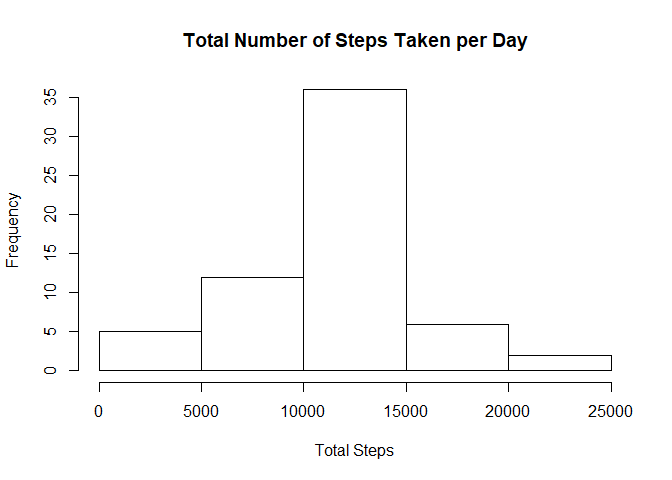

## Loading and preprocessing the data

Initially, ensure the working directory is set to be the directory in which the raw data
file, "activity.csv", is located. This can be done using the R command setwd().

Next, load the packages needed for the following analysis.

```r
knitr::opts_chunk$set(echo = TRUE)
library(dplyr)
library(magrittr)
library(ggplot2)
```

Then, load the dataset into R using the R command read.csv() and reformat the date variable to be of type Date using the R command as.Date().

```r
data <- read.csv("activity.csv")
data$date <- as.Date(data$date)
```

## What is mean total number of steps taken per day?

Calculate the total number of steps taken per day.

```r
tdata <- data %>% group_by(date) %>% summarize(total_steps = sum(steps, na.rm = TRUE)) 
tdata
```

```
## # A tibble: 61 x 2
##    date       total_steps
##    <date>           <int>
##  1 2012-10-01           0
##  2 2012-10-02         126
##  3 2012-10-03       11352
##  4 2012-10-04       12116
##  5 2012-10-05       13294
##  6 2012-10-06       15420
##  7 2012-10-07       11015
##  8 2012-10-08           0
##  9 2012-10-09       12811
## 10 2012-10-10        9900
## # ... with 51 more rows
```

Create a histogram of the total number of steps taken each day.

```r
hist(tdata$total_steps, main = "Total Number of Steps Taken per Day", xlab = "Total Steps")
```

<!-- -->

Calculate the mean and median of the total number of steps taken per day.

```r
rmean <- mean(tdata$total_steps)
rmedian <- median(tdata$total_steps)
```
The mean total number of steps taken per day is 9354.2295082 and the median total number of steps taken per day is 10395.

## What is the average daily activity pattern?

Create a time series plot of the 5-minute interval (x-axis) and the average number of steps taken, averaged across all days (y-axis).

```r
mdata <- data %>% group_by(interval) %>% 
  summarize(average_steps = mean(steps, na.rm = TRUE))
plot(mdata$interval, mdata$average_steps, type = "l", xlab = "Interval", ylab = "Average Number of Steps",main = "Average Daily Activity Patterns")
```

<!-- -->

Determine the 5-minute interval, on average across all the days in the dataset, which contains the maximum number of steps.

```r
maxint <- mdata$interval[which.max(mdata$average_steps)]
```
The interval 835 contains, on average, the maximum number of steps.

## Imputing missing values

Calculate the total number of missing values in the dataset.

```r
numNA <- sum(is.na(data$steps))
```
There are 2304 missing values in the dataset.

Create a new dataset that is equal to the original dataset but with the missing values replaced with the mean for that 5-minute interval averaged across all the days in the dataset.

```r
newdata <- data
for (i in which(is.na(data$steps))) {
  interval_value <- data$interval[i]
  row_value <- which(mdata$interval == interval_value)
  interval_average <- mdata$average_steps[row_value]
  newdata$steps[i] <- interval_average
}
```

Create a histogram of the total number of steps taken each day using the new dataset (which has the missing values replaced).

```r
tnewdata <- 
  newdata %>% group_by(date) %>% summarize(total_steps = sum(steps, na.rm = TRUE))
hist(tnewdata$total_steps, main = "Total Number of Steps Taken per Day", xlab = "Total Steps")
```

<!-- -->

Calculate the mean and median total number of steps taken per day using the new dataset.

```r
rnewmean <- mean(tnewdata$total_steps)
rnewmedian <- median(tnewdata$total_steps)
```
The mean total number of steps taken per day using the new dataset is 1.0766189\times 10^{4} (compared to 9354.2295082 steps in the original dataset) and the median total number of steps taken per day is 1.0766189\times 10^{4} (compared to 10395 steps in the original dataset).

## Are there differences in activity patterns between weekdays and weekends?

Create a new factor variable in the dataset with two levels - "weekday" and "weekend".

```r
day_type <- lapply(newdata$date, weekdays)
for (i in 1:length(day_type)) {
  if (day_type[i] == "Saturday" | day_type[i] == "Sunday") {
    day_type[i] <- "weekend"
  }
  else {
    day_type[i] <- "weekday"
 }
}
day_type <- factor(day_type, levels = c("weekday", "weekend"))
dnewdata <- mutate(newdata, day_type = day_type)
head(dnewdata)
```

```
##       steps       date interval day_type
## 1 1.7169811 2012-10-01        0  weekday
## 2 0.3396226 2012-10-01        5  weekday
## 3 0.1320755 2012-10-01       10  weekday
## 4 0.1509434 2012-10-01       15  weekday
## 5 0.0754717 2012-10-01       20  weekday
## 6 2.0943396 2012-10-01       25  weekday
```

Make a panel plot containing a time series plot of the 5-minute interval (x-axis) and the average number of steps taken, averaged across all weekday days or weekend days (y-axis).

```r
gnewdata <- 
  dnewdata %>% group_by(interval, day_type) %>%
  summarize(average_steps = mean(steps))

g <- ggplot(gnewdata, aes(interval, average_steps)) + 
  geom_line() + 
  facet_grid(day_type~.) + 
  labs(x = "Interval", y = "Average Number of Steps")
print(g)
```

<!-- -->
